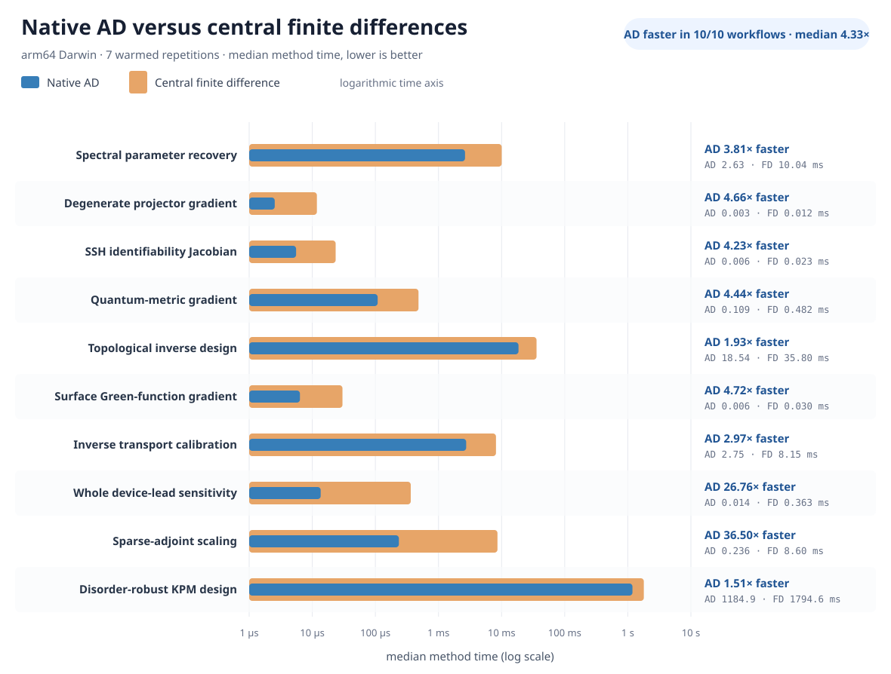

# Thouless benchmark

Fifty-two LKM-motivated, executable tight-binding workflows comparing native
[Thouless](https://github.com/matrixlab-research/thouless) Rust with the
original PythTB 2.0 and Kwant 1.5 packages.

The benchmark asks scientific questions rather than timing isolated kernels.
Each case defines a model, an observable, an analytic or invariant-based gate,
and its public LKM question and paper provenance. The source papers motivate
the questions; the compact lattice cases are explicitly benchmark adaptations,
not claims to reproduce those papers.

## Tracks

| Track | Cases | Backends |
|---|---:|---|
| Bulk bands and topology | 12 | Thouless, PythTB, and Kwant where applicable |
| Finite boundaries | 4 | Thouless, PythTB, and Kwant |
| Open-system transport | 4 | Thouless and Kwant; PythTB is not a transport solver |
| Whole-problem domain witnesses | 22 | Backend applicability is explicit |
| Native automatic differentiation | 10 | Thouless native Rust |
| AD versus no-AD paired comparisons | 10 | Thouless native Rust |

The original manifest is [`benchmark/cases.json`](benchmark/cases.json).
Whole-problem witnesses are frozen in
[`benchmark/domain_cases.json`](benchmark/domain_cases.json).
The ten domain-facing native AD witnesses are frozen in
[`benchmark/ad_cases.json`](benchmark/ad_cases.json) and explained in
[`docs/ad-benchmarks.md`](docs/ad-benchmarks.md), with
[one specification per problem](docs/ad-problems/README.md).
The same ten workflows also have a
[native-AD versus central-finite-difference comparison](docs/ad-method-comparison.md).

## Domain problem catalog

The documentation system also contains
[100 domain-first scientific problem specifications](docs/problems/README.md),
organized into twenty research suites. Each problem has its own Markdown file
with:

- a scientific question and benchmark adaptation;
- parameter ranges, meanings, and units;
- the required calculation and expected result;
- acceptance, convergence, and held-out-family rules; and
- LKM and paper provenance.

These documents define benchmark problems before API design. Sixty-seven are
now marked `executable`; thirty-three remain `proposed`. The canonical
[100-question by three-backend audit](benchmark/problem_coverage.json)
distinguishes complete implementation, implementability without verification,
missing reusable capability, and scientific non-applicability. A related model
or single observable is not counted as a whole-problem implementation.

The same immutable anchors now have
[100 domain-first AD companion requirements](docs/ad-requirements/README.md).
Each companion records when differentiation is essential, helpful,
conditional, or not central; names the continuous controls and scientific
outputs; freezes a no-AD control; and separates missing forward physics from a
missing AD rule. The machine-readable
[100-row matrix](benchmark/ad_requirements.json) is the source for the
[Rust-native capability plan](docs/rust-native-ad-capability-plan.md). The
existing ten AD workflows touch fourteen questions as evidence witnesses, but
do not define the requirements or claim complete coverage of those TBQs.

## Comparison policy

- Correctness is primary. Analytic spectra, quantized invariants, symmetry
  transformations, bulk-boundary correspondence, and exact transport limits
  are the reference gates.
- Cross-backend agreement is reported but is never the sole source of truth.
- `implementable_unverified` requires source evidence for every specialized
  primitive, but remains unscored until an end-to-end evaluator passes.
- `missing_capability` means test orchestration alone is insufficient.
- `not_applicable` is reserved for a core workflow outside the package's
  declared scope; it is not inferred from a missing API alone.
- The original PythTB and Kwant packages are installed in an isolated Python
  environment. The repository rejects imports from a Thouless compatibility
  tree.
- Thouless is executed as a Rust binary pinned to an exact Git commit.
- Timing measurements are descriptive. CI does not assert that one backend
  must be faster.

## Status

The original twenty-case seed remains fully implemented:

| Backend | Implemented | Applicable | Remaining |
|---|---:|---:|---:|
| Thouless native Rust | 20 | 20 | 0 |
| Original PythTB 2.0.0 | 16 | 16 | 0 |
| Original Kwant 1.5.0 | 19 | 19 | 0 |

The [verified result set](results/verified/2026-07-26-implemented.json) contains
all twenty end-to-end workflows. The finite-boundary track includes SSH and
Haldane spectral flow, graphene termination signatures, and BBH corner modes.
The open-system track includes ballistic and resonant transport,
Aharonov-Bohm interference, and a disordered Hofstadter strip with
edge-localized bond current. All fifty-five applicable backend-case executions
pass their analytic or invariant-based checks. See
[`benchmark/implementation.json`](benchmark/implementation.json) and
`python tools/coverage_report.py`.

Strict whole-problem coverage of the 100-question catalog is:

| Backend | Implemented | Implementable, unverified | Missing capability | Not applicable | Verified coverage |
|---|---:|---:|---:|---:|---:|
| Thouless native Rust | 67 | 0 | 18 | 15 | 67% |
| Original PythTB 2.0.0 | 12 | 16 | 42 | 30 | 12% |
| Original Kwant 1.5.0 | 13 | 46 | 21 | 20 | 13% |

The twenty-two domain witnesses include the original spectral, magnetic, BdG,
lead, and spin-texture cases plus seventeen native Thouless suite workflows.
Those workflows contribute exactly fifty-four question-specific gates covering
model fidelity, Fermiology, topology, boundaries, nonlinear response, disorder,
transport, continuum discretization, non-Hermitian spectra, large geometry,
spin response, KPM, arbitrary graphs, defects, multiscale validation, and
sparse production paths up to one million states. `Implementable, unverified`
is an engineering queue, not coverage; `missing capability` requires a reusable
package feature before an end-to-end benchmark can be honest.

## Same-machine timing

The original cross-backend timing snapshot contains seven repetitions per
backend-case on one arm64 macOS machine. Kernel time excludes import and process
startup; process wall time includes both. The table reports median kernel
milliseconds:

| Workflow | PythTB | Kwant | Thouless |
|---|---:|---:|---:|
| Spectral reliability | 716.10 | 207.42 | 20.96 |
| Magnetic Hofstadter | 78.99 | 162.71 | 1.42 |
| BdG and Majorana | 14.50 | 40.21 | 1.52 |
| Lead calibration | not applicable | 10.89 | 0.14 |
| Spin-texture covariance | 11.60 | 10.06 | 4.48 |

Median process-wall ranges are 294–991 ms for PythTB, 524–735 ms for Kwant,
and 2.6–24.3 ms for Thouless. These numbers describe these complete adapters,
including their model-assembly choices; they are not isolated eigensolver
microbenchmarks. The local Kwant environment used SciPy's solver because MUMPS
was unavailable. See the
[raw repeated result](results/verified/2026-07-27-domain.json).

The expanded
[31-record correctness snapshot](results/verified/2026-07-27-domain-expanded.json)
uses three repetitions and includes all twenty-two Thouless domain workflows.
It is the result set used for the current 67-question Thouless coverage claim.

## Native AD benchmark status

Ten LKM-discovered research-workflow adaptations now exercise the merged
Rust-native AD stack: Rice-Mele spectral inference, BHZ Kramers subspaces, SSH
identifiability, Rice-Mele quantum geometry, QWZ topological design, SSH
boundary Green functions, double-quantum-dot inference, resonant-level contact
sensitivity, Anderson sparse adjoints, and disordered-SSH KPM design.

All 30 required checks pass in the
[seven-repetition research-workflow snapshot](results/verified/2026-07-28-ad-research-workflows.json)
against Thouless commit
`237f544c497e89cd99dedd68f16e399bc9980987`. The public validation points and
disorder seeds are development evidence, not the isolated held-out evaluator.
AD witnesses also do not automatically change strict whole-problem TBQ
coverage. The complete LKM search and reasoning evidence is preserved under
[`evidence/lkm/2026-07-28-ad-research-workflows`](evidence/lkm/2026-07-28-ad-research-workflows/README.md).

The
[paired no-AD comparison](results/verified/2026-07-28-ad-vs-finite-difference.json)
uses the same Rust forward objectives, scientific products, and optimizer
conditions. Native AD is faster in all ten recorded warmed workloads, with a
median 4.33× speedup. The range is scientifically informative: the
one-parameter QWZ and four-parameter KPM designs show modest gains, while the
64-parameter sparse-adjoint workflow is 36.50× faster with native AD.
Accuracy and scientific equivalence are gated; relative timing is not.



The overlaid bars use a logarithmic time axis because the workflows span
microseconds to seconds. The wider orange bar is the central finite-difference
baseline and the narrower blue bar is native AD; lower is better. The figure
is generated directly from the verified result by
[`tools/render_ad_comparison_chart.py`](tools/render_ad_comparison_chart.py).

PythTB 2.0 requires NumPy 2, while Kwant 1.5 currently builds against NumPy
1.26. They therefore run in separate environments. Combining both into one
Python environment is not a supported benchmark configuration.

Local setup and execution:

```bash
uv sync --python 3.12 --extra pythtb --extra test
uv venv --python 3.12 .venv-kwant
uv pip install --python .venv-kwant/bin/python \
  -r requirements/kwant-build.txt
uv pip install --python .venv-kwant/bin/python --no-build-isolation \
  tinyarray==1.2.5 kwant==1.5.0
uv pip install --python .venv-kwant/bin/python --no-deps -e .
python tools/collect_seed.py
python tools/collect_domain_results.py
python tools/run_thouless_cases.py --track ad
python tools/collect_ad_results.py
python tools/check_ad_results.py --current results/local/ad.json
python tools/run_thouless_cases.py --track ad-comparison
python tools/collect_ad_comparison.py
python tools/check_ad_comparison.py \
  results/local/ad-vs-finite-difference.json
python tools/build_problem_coverage.py --check
python tools/check_problem_docs.py
python tools/build_ad_requirements.py --check
python tools/check_ad_requirements.py
```

Every completed workflow must satisfy
[`instructions/benchmark-implementation.md`](instructions/benchmark-implementation.md).

This is a public benchmark, not the isolated held-out evaluator for Thouless.
